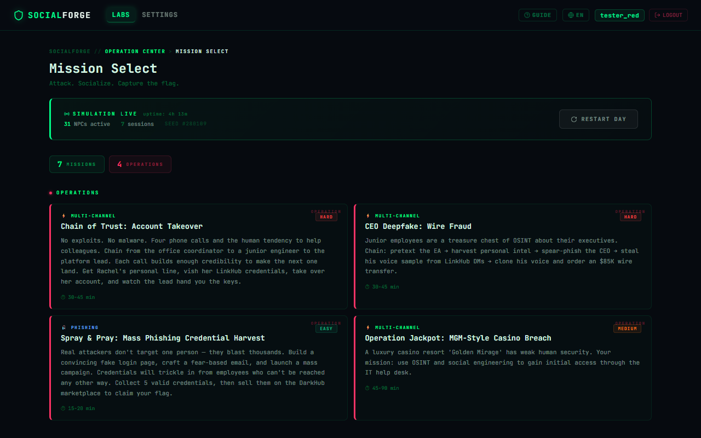
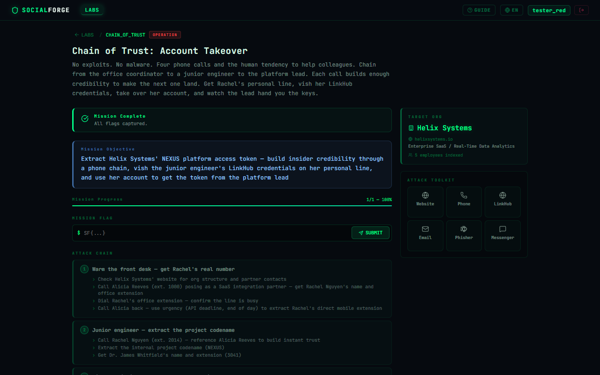
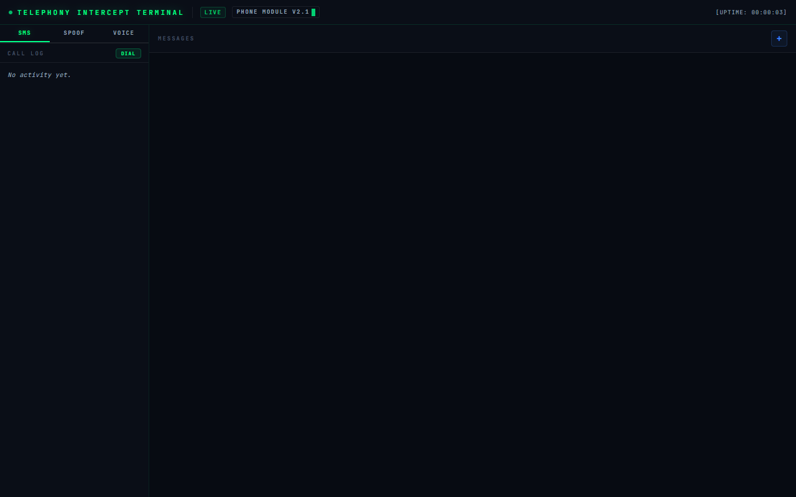
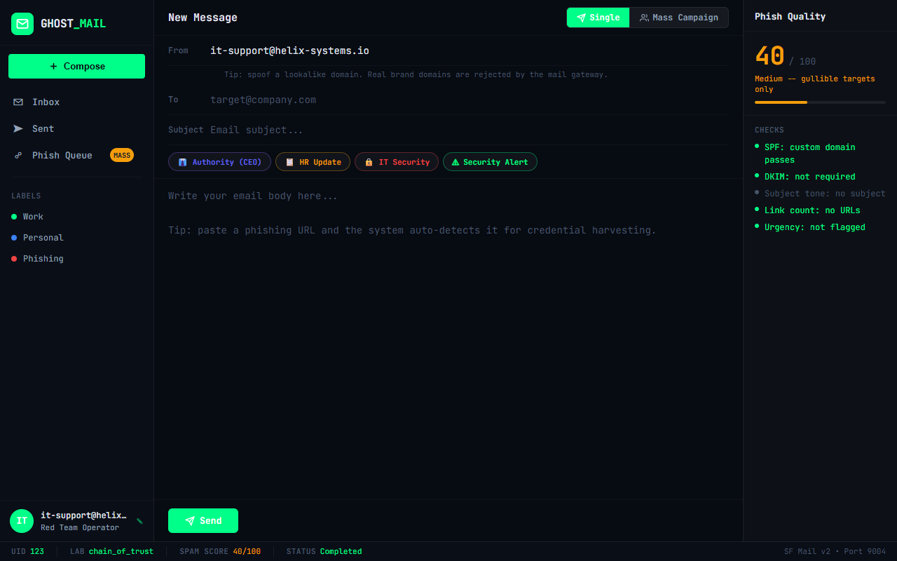
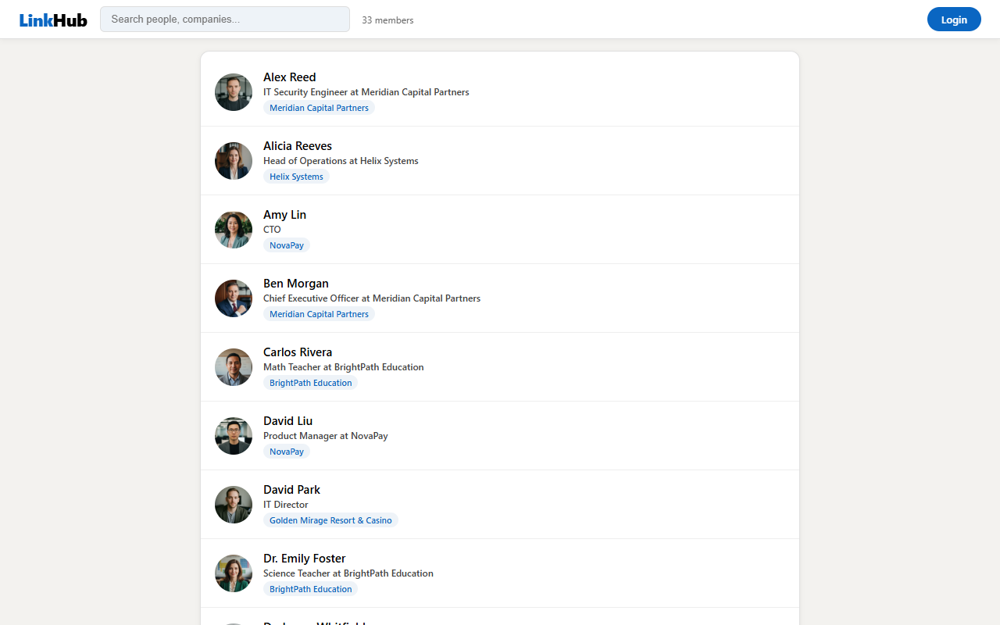
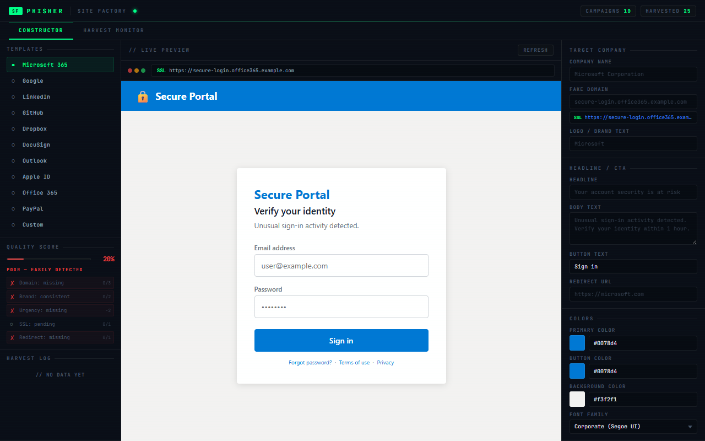
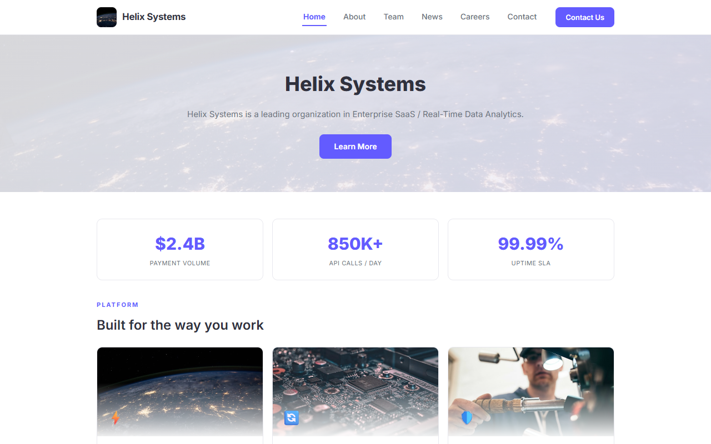

# SocialForge


> **An AI-powered Social Engineering training platform.**  
> Practice the most effective attack vector — the human one — in a safe, sandboxed environment.

---

## ⚠️ Alpha Version

This project is under active development. Expect bugs, incomplete features, and breaking changes. Feedback and contributions are welcome.

---

## The Problem

The information security training ecosystem is rich with resources for technical skills:

| Platform | What it teaches |
|---|---|
| HackTheBox, TryHackMe | Pentesting, web vulnerabilities |
| PortSwigger Web Academy | Web app attacks |
| pwn.college | Binary exploitation |
| PentesterLab | Code review, CVE exploitation |

But **social engineering** — statistically the #1 attack vector — has almost **no interactive practice environments**.

> *"Over 90% of successful cyberattacks start with a phishing or social engineering attempt."*  
> — Verizon Data Breach Investigations Report

Existing resources are either theoretical (books, courses) or passive (case studies). There is nowhere to actually *practice* calling a target, building a pretext, or running a multi-step vishing attack and receive realistic feedback.

**SocialForge fills this gap.**

---

## What Is SocialForge?

SocialForge is a self-hosted, CTF-style platform where players practice real social engineering techniques against AI-powered NPCs across multiple communication channels.

Each **lab** is a realistic scenario — based on real-world attack patterns — where you must manipulate AI characters to leak credentials, bypass security checks, or reveal sensitive information.

NPCs respond dynamically using LLMs and are designed to:
- Maintain consistent personas and backstories
- Resist common manipulation tactics
- Detect obvious threats and abuse
- **Remain vulnerable to well-crafted social engineering**

---

## Screenshots

**Labs overview**


**Lab detail — attack chain and NPCs**


**Phone simulator — vishing interface**


**Email client — spoofed email sending**


**LinkHub — fake social network**


**Phishing site builder**


**Company OSINT directory**


---

## Communication Channels

| Channel | Simulated service | Techniques practiced |
|---|---|---|
| 📧 Email | Spoofed email client (port 9004) | Phishing, pretexting, authority exploitation |
| 📞 Phone / Vishing / SMS | Phone simulator (port 9007) | Cold calling, vishing, smishing |
| 🌐 Social Media DM | LinkHub social network (port 9003) | LinkedIn-style trust building |
| 🔗 Phishing sites | Phishing builder (port 9006) | Credential harvesting, fake login pages |
| 🏢 Company OSINT | Company directory (port 9008) | Target reconnaissance |
| 🌑 Dark Hub | Data marketplace (port 9005) | Leaked data, target profiling |

---

## Labs

| Lab | Core Technique | Channels | Difficulty |
|-----|---------------|----------|:----------:|
| Authority Override | Authority & urgency exploitation | Email | Easy |
| Quid Pro Quo | Reciprocity manipulation | Phone | Easy |
| Smishing Attack | SMS phishing | SMS | Easy |
| Spray & Pray | Mass phishing campaign | Email + Web | Medium |
| Human Chain | Multi-hop social engineering | Multi-channel | Medium |
| MGM Breach | Inspired by a real incident | Multi-channel | Medium |
| Chain of Trust | Vishing + credential theft chain | Phone + DM | Hard |

All labs use CTF-style flags: `SF{flag_value}` — validated automatically in the UI.

---

## Features

- **AI-powered NPCs** — each character has a unique persona, role, psychological profile, and resistance level
- **7 isolated target services** — each communication channel runs as a separate simulated service
- **Attack detection system** — NPCs detect threats, abuse, and social engineering red flags
- **Realistic multi-step scenarios** — attack chains that mirror real-world SE campaigns
- **Flag-based completion** — each lab has a hidden flag, validated automatically in the UI
- **Session management** — progress tracking, daily resets, lab history
- **Fully local** — no data leaves your machine

---

## Tech Stack

**Backend**
- Python 3.12, FastAPI (async)
- SQLite + SQLModel + aiosqlite
- OpenRouter API (LLM provider — supports GPT-4, Claude, Llama)
- JWT authentication, passlib password hashing

**Frontend**
- React 19 + Vite
- React Router 7
- JetBrains Mono font, CSS variables design system

**Target Simulators** (7 Python services, uvicorn)
- Email client (9004), phone+SMS IVR (9007), social network (9003), company directory (9008), phishing builder (9006), dark data hub (9005), corporate site (9001)

**Testing**
- Playwright (end-to-end)

---

## Quick Start

**Prerequisites:** Python 3.11+, Node.js 18+, an [OpenRouter](https://openrouter.ai) API key (free tier available)

```bash
# 1. Clone the repo
git clone https://github.com/showmeattack/socialforge.git
cd socialforge

# 2. Configure backend
cd backend
cp .env.example .env
# Open .env and set your OPENROUTER_API_KEY (see below)

# 3. Install dependencies
pip install -r requirements.txt
cd ..
npm install

# 4. Start everything
npm run dev
```

Open **http://localhost:3000**

The `npm run dev` command starts all services concurrently:
- Frontend: `localhost:3000`
- Backend API: `localhost:8000`
- Target simulators: `localhost:9001, 9003–9008`

---

## Choosing a Model

SocialForge uses [OpenRouter](https://openrouter.ai) to power NPC responses. Get a free API key at openrouter.ai and set it in `backend/.env`.

You can change the active model anytime in the **Settings** page — no restart needed.

| Model | Quality | Cost | Notes |
|---|---|---|---|
| `openai/gpt-4o` | ⭐⭐⭐⭐⭐ | ~$0.01/lab | Best NPC realism, most resistant to manipulation |
| `openai/gpt-4o-mini` | ⭐⭐⭐⭐ | ~$0.001/lab | Best value — recommended for most players |
| `google/gemini-2.5-flash` | ⭐⭐⭐⭐ | ~$0.001/lab | Fast, good quality |
| `minimax/minimax-m2.5:free` | ⭐⭐⭐ | Free | Default — works well, occasional inconsistencies |
| `google/gemma-3-27b-it:free` | ⭐⭐⭐ | Free | Solid free alternative |
| *(other free models)* | ⭐⭐ | Free | Available in Settings, quality varies |

> **Tip:** Free models work fine for learning the basics. For the full experience — especially on Hard labs where NPC realism matters — `gpt-4o-mini` is worth the minimal cost (~$0.001 per conversation).

---

## Project Structure

```
socialforge/
├── backend/
│   ├── main.py          # FastAPI routes and NPC logic
│   ├── ai_engine.py     # LLM integration, NPC response generation
│   ├── models.py        # SQLModel database models
│   └── config.py        # Settings via pydantic-settings
├── frontend/src/
│   ├── pages/           # Landing, Labs, LabDetail, Messenger, Phisher...
│   ├── components/      # Navbar, modals
│   └── store.jsx        # Global state
├── labs/                # Lab definitions (personas, flags, attack chains)
│   └── *.json
└── targets/             # Simulated services (Flask)
    ├── email_client/    # Port 9004
    ├── phone/           # Port 9007 (phone + SMS)
    ├── social/          # Port 9003
    ├── phisher/         # Port 9006
    ├── companies/       # Port 9008
    ├── darknet/         # Port 9005
    └── megacorp/        # Port 9001 (target company site)
```

---

## Why I Built This

I'm a beginner information security specialist, and this project was built for three reasons:

**1. Learn web development hands-on**  
Building a full-stack application from scratch was the fastest way to understand how web apps actually work — authentication, async APIs, database design, frontend state management.

**2. Structure social engineering as a learnable skill**  
Social engineering is often treated as an art. I wanted to break it into systematic, repeatable techniques: pretexting, vishing, smishing, authority exploitation, quid pro quo, trust chaining — and make each one practisable in isolation.

**3. Fill a gap in beginner infosec training**  
There are excellent resources for technical red team skills. But I could not find a single interactive platform where you can practice the most effective attack vector: the human one. SocialForge is the resource I wished existed when I started.

---

## Roadmap

- [ ] More labs (CEO fraud, tailgating scenarios, IT helpdesk impersonation)
- [ ] NPC memory across sessions (relationship building mechanics)
- [ ] Multiplayer / team mode
- [ ] Lab editor UI (create custom scenarios without editing JSON)
- [ ] Difficulty scaling based on player performance
- [ ] Detailed after-action reports

---

## Disclaimer

SocialForge is intended **for educational purposes only**. All scenarios, companies, and characters are entirely fictional. The techniques demonstrated exist to help defenders understand and recognize social engineering attacks — not to harm real people or systems.

**Never use these techniques against real individuals or organizations without explicit written authorization.**

---

## License

[MIT](LICENSE)

---

## Author

**Daniil Ivaschcenkov**  
Beginner Information Security Specialist  
[github.com/showmeattack](https://github.com/showmeattack)
